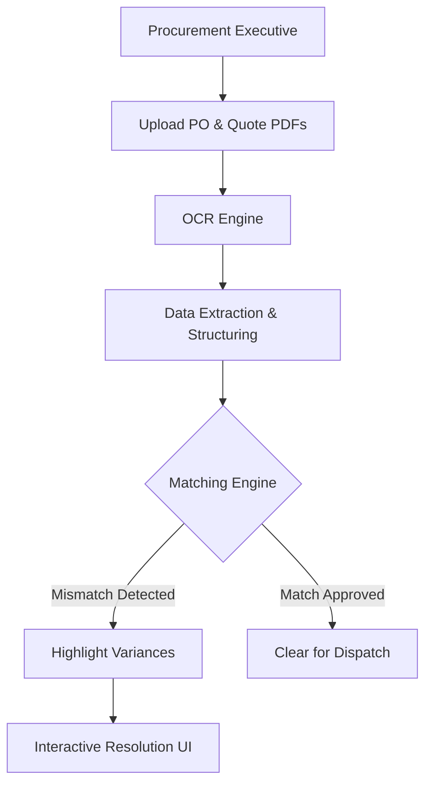

# Product Requirements Document: PO Match

**Author:** Harpreet Kaur
**Status:** V1 Prototype
**Repo:** github.com/kharpreet007/po-match-buddy

---

## 1. Problem Statement

Procurement executives at small and medium enterprises (SMEs) validate every Purchase Order (PO) against the supplier's quotation before it goes out — checking supplier name, item name, item code, quantity, unit price, tax, and unit of measure. Today this is done manually, line by line, across PDFs and Excel sheets, often cross-referenced over email and WhatsApp.

This manual comparison:
- Takes **~45 minutes per PO**, for procurement staff processing ~20 POs a day
- Is error-prone — a missed quantity or price mismatch can mean over-ordering, incorrect billing, or a disputed invoice down the line
- Requires no specialized skill, just sustained attention — making it tedious, repetitive work that doesn't scale with order volume

Existing solutions (ERPs, procurement suites) are too heavy for this problem. SMEs don't need end-to-end procurement workflows or vendor management — they need one thing done well: **catch mismatches before the PO is sent.**

## 2. Product Overview

PO Match is a lightweight, AI-powered validation tool that compares a supplier quotation against a Purchase Order and surfaces every mismatch — supplier name, item name, item code, quantity, unit price, tax, and unit of measure — in under 60 seconds.

**What it is:** A focused, single-purpose validation utility with zero onboarding and zero ERP integration.

### System Architecture

**What it is not:**
- Not an ERP
- Not a procurement suite
- Not a vendor management or purchasing workflow tool

The product succeeds if a procurement executive can upload two documents and walk away confident the PO is correct — without opening Excel to manually cross-check.

## 3. Target User

**Persona: Rahul, Procurement Executive**

- Works at a retail SME
- Processes ~20 Purchase Orders daily
- Primary tools today: Excel, PDFs, Gmail, WhatsApp
- Not a power user of enterprise software — needs a tool that requires no training
- Core need: **confidence** before a PO goes out to a supplier, without spending 45 minutes per order verifying it by hand

**Job to be Done:** *"When I'm about to send a Purchase Order to a supplier, I want to know instantly if it matches their quotation, so I can send it with confidence instead of manually checking every line."*

## 4. Goals & Success Metrics

| Metric Type | Metric | Target |
|---|---|---|
| North Star | PO validation time | Reduce from ~45 min → under 60 seconds |
| Adoption | POs validated per day per user | 20 (matches current manual volume) |
| Trust | Validation confidence score shown to user | ≥90% average |
| Efficiency | Time saved (displayed to user) | Sum of (manual time − actual time) across validations |
| Quality | Errors prevented | Mismatches caught before PO is sent to supplier |

## 5. Scope

### In Scope (V1)
- Upload two documents: supplier quotation and Purchase Order (PDF or Excel)
- Automated field-level comparison across 7 fields: Supplier Name, Item Name, Item Code, Quantity, Unit Price, Tax, Unit of Measure
- Visual mismatch report with severity coding (exact match / minor difference / mismatch)
- Suggested corrections per mismatched field
- Downloadable/exportable validation report (PDF)
- Validation history and basic analytics (trends, most common error type)

### Out of Scope (V1)
- ERP or accounting system integration
- Multi-user roles, approvals, or workflow routing
- Supplier-side access or two-way communication
- Editing/correcting the source PO or quotation within the tool
- Automatic sending of corrected POs to suppliers

## 6. Core User Flow

1. **Dashboard** — Rahul lands on a summary of today's activity (POs validated, average time, errors prevented) and starts a new validation.
2. **Upload** — He uploads the supplier quotation and the PO side by side (PDF or Excel).
3. **Comparison (in progress)** — The tool reads, extracts, and compares both documents, showing a progress timeline so Rahul trusts the process rather than staring at a blank loading screen.
4. **Validation Report** — Rahul sees a validation score, list of issues, and a field-by-field comparison table color-coded by severity. He can click into any mismatch for the reason and a suggested correction.
5. **Resolution** — He downloads the report as a reference, or starts validating the next PO.
6. **History & Analytics** — Over time, Rahul can review past validations and spot recurring issues (e.g., a supplier who consistently misquotes price).

## 7. Functional Requirements

### 7.1 Dashboard
- Hero CTA to start a new validation ("Upload Documents") and a secondary "View Demo" for first-time users
- Three KPI cards: POs Validated Today, Average Validation Time, Errors Prevented
- Recent Validations table: Date, Supplier, Status, Issues Found, Time Saved, Action
- Drag-and-drop upload entry point supporting PDF and .xlsx

### 7.2 Upload Documents
- Two side-by-side upload panels: Supplier Quotation and Purchase Order
- Each panel supports PDF or Excel upload, shows filename and a preview thumbnail
- Primary action: "Compare Documents"; secondary: "Cancel"
- Upload progress indicator and supported-format helper text

### 7.3 Comparison in Progress
- Step-by-step progress timeline: reading quotation → reading PO → extracting tables → comparing fields → detecting mismatches
- Estimated time to completion (~45 seconds)
- Live activity log (e.g., "Extracted 17 line items," "Matched supplier," "Comparing prices") to build trust during processing
- No exposed technical/AI jargon — framed as "Validating Documents"

### 7.4 Validation Report (core screen)
- Summary card: Validation Score, Issues Found, Time Saved, Confidence
- Field-by-field comparison table (Supplier Name, Item Name, Item Code, Quantity, Unit, Price, Tax, Delivery Date) with quotation vs. PO values
- Status color coding: green (exact match), orange (minor difference), red (mismatch)
- Row click opens a side panel with: reason for mismatch, suggested correction, and a "copy suggested value" action
- Actions: Download Report (PDF), Validate Another PO

### 7.5 History & Analytics
- Aggregate metrics: POs Validated, Average Validation Time, Most Common Error, Time Saved
- Weekly validation trend chart
- Error distribution breakdown (price / quantity / item / supplier mismatch)
- Searchable/filterable report history (by supplier, date, status) with view/download actions

## 8. Design Principles

- Material Design 3, enterprise-SaaS aesthetic (comparable to Linear, Notion, Stripe Dashboard) — minimal, professional, generous white space, soft elevation, 12–16px rounded corners
- Desktop-first, responsive layout
- No dark mode, no glassmorphism, no flashy gradients — clarity over decoration
- Every core interaction completable in under three clicks
- Progressive disclosure — never show more than the user needs at that step
- Informative empty states, clear success/error messaging, subtle loading animations
- Plain-language copy — "Comparison in Progress" / "Validating Documents" instead of exposing "AI Engine" as a concept

## 9. Sample Validation Logic

**Example: ABC Traders — Milk Powder**

| Field | Quotation | Purchase Order | Result |
|---|---|---|---|
| Supplier | ABC Traders | ABC Traders | ✅ Matched |
| Item | Milk Powder | Milk Powder | ✅ Matched |
| Quantity | 100 | 1000 | ❌ Mismatch |
| Price | ₹520 | ₹580 | ⚠️ Minor difference |

This is the kind of discrepancy that costs a procurement executive real money if it slips through manual review — a 10x quantity error or an unnoticed price bump — and is exactly what PO Match is designed to catch automatically.

## 10. Risks & Assumptions

| Risk | Mitigation |
|---|---|
| Document extraction accuracy varies across PO/quotation formats (scanned PDFs, inconsistent Excel templates) | Start with common structured formats; set expectations on supported formats in-product |
| Users may not trust an automated match without understanding *why* something was flagged | Side panel always explains the reason for a mismatch and suggests a correction |
| Zero-integration design limits stickiness over time | Analytics/history creates a reason to return; future versions could explore lightweight integrations |

## 11. Future Considerations (Post-V1)

- Email/WhatsApp forwarding of validation reports directly to suppliers
- Bulk validation (multiple POs at once)
- Supplier-level trend flags (e.g., "This supplier has mismatched price on 4 of the last 5 POs")
- Lightweight integrations with common accounting tools (Tally, Zoho Books) as an optional, not required, connection
