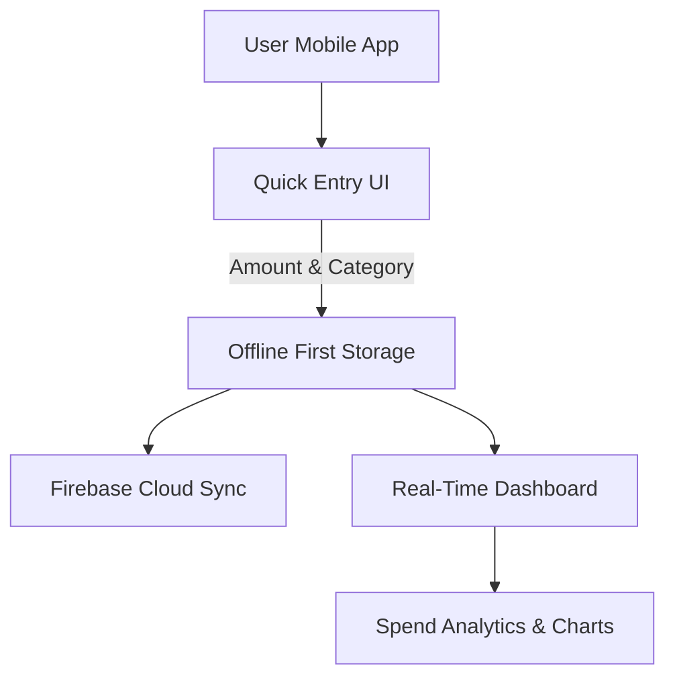

# Kharch — Product Requirements Document (PRD)

**Product:** Kharch (Expense Tracker)
**Author:** Harpreet
**Status:** Draft v1.0
**Doc type:** MVP PRD

---

## 1. Overview

Kharch is a minimal expense tracker built around a single philosophy: **capture an expense in under 5 seconds, understand spending at a glance, and let nothing else get in the way.**

It is deliberately *not* a finance management platform. There are no bank integrations, no budgeting rules, and no complex analytics in v1. Every design and product decision is filtered through one question: *does this help someone log an expense faster, or understand their spending more clearly?* If not, it's cut.

### Core Data Flow



---

## 2. Problem Statement

People who transact frequently — especially via UPI, 5–10 times a day — lose track of where their money goes because existing expense trackers ask for too much upfront effort (categorization rules, budgets, manual bank linking, long onboarding). The friction of logging an expense causes users to defer it, and a deferred log is very often a log that never happens.

Kharch removes friction from the single moment that matters most: the few seconds right after a purchase, when the user still remembers it.

---

## 3. Core User / Persona

**Harpreet, 32, working professional**
- Makes 5–10 UPI transactions a day
- Wants to log an expense *before she forgets*
- Has zero tolerance for data entry that feels like a chore
- Every additional tap or mandatory field is a reason she abandons the app

Every screen is designed for this person first. If a feature doesn't serve her core loop (spend → log → glance at total), it's deprioritized.

**Job to be Done:** "When I spend money, I want to log it in a few seconds without thinking, so that I can see where my money is going without any ongoing effort."

---

## 4. Product Principles

1. **Speed over completeness.** Amount + Category is the only mandatory pair. Everything else is optional and collapsed by default.
2. **One primary number at a time.** Today / week / month spend — never all three competing for attention simultaneously.
3. **3-tap, 5-second rule.** If a core action takes more than 3 taps or 5 seconds, the flow is wrong.
4. **Minimal is more.** When in doubt about adding an element, leave it out.
5. **Design for extensibility, not for feature creep.** The data model should support future features (recurring expenses, wallets, AI insights) without those features being built — or their UI shipped — in v1.

---

## 5. Primary User Flow (fixed shape — do not add steps)

```
Open App → Home/Dashboard → Tap "+" → Enter Amount → Select Category → Save → Dashboard updates instantly
```

- Notes, date, and payment method are optional/secondary and never block Save.
- Date defaults to today.
- Payment method defaults to the last one used.

---

## 6. Design Direction (summary)

Dark, minimal, premium — CRED-inspired "neoPOP" *philosophy*, not any copyrighted asset.

- **Dark-first UI:** near-black, warm charcoal background (#0B0B0D). Light mode is post-v1.
- **One confident accent color** (warm gold or lime) used sparingly for CTAs and positive numbers; everything else greyscale.
- **Bold, oversized numbers** as the visual hero of every card/row.
- **Rounded, tactile cards** (16–20px radius), soft elevation instead of hard borders.
- **Minimal line iconography**, one accent color max per icon.
- **Micro-interactions over decoration:** tap scale/opacity, animated number count-ups, a confirmation pulse on save.
- **Generous whitespace.**
- **One typeface** (e.g. Inter/Poppins) across all screens — hierarchy comes from weight, not decoration.

---

## 7. Scope

### 7.1 MVP Scope (build first)

| # | Feature | Notes |
|---|---|---|
| 1 | Add Expense | Amount, category, optional note/date, one-tap save |
| 2 | Categories | Fixed list (Food, Shopping, Bills, Transport, Entertainment, Health, Education, Travel, Others) |
| 3 | Dashboard | Today / week / month spend toggle |
| 4 | Spending Breakdown | Pie/donut chart by category, period toggle |
| 5 | Expense History | List, search, filter (category, date range, payment method) |
| 6 | Edit / Delete | Same layout as Add, pre-filled; single-tap confirm delete |
| 7 | Monthly Summary | Income (optional), total expenses, remaining balance, savings % |

### 7.2 Explicitly Out of Scope for v1

Dark/light mode toggle (ship dark-only), CSV export, voice entry, OCR receipt scanning, recurring expenses, multiple wallets, shared/family wallets, AI insights, savings goals, subscription reminders, bank integration.

> The data model should be designed so these can be added later — but no UI is built for them now.

---

## 8. Screen-Level Requirements

### 8.1 Home / Dashboard
- Hero number: Today's / This week's / This month's spending, one at a time via tab/toggle.
- Floating, always-reachable "+" add-expense button.
- Compact spending-breakdown preview (mini pie/donut) with tap-through to full breakdown.
- Last 3–5 expenses with a "view all" link.

### 8.2 Add Expense (bottom sheet / full-screen modal, optimized for speed)
- Large numeric keypad, auto-focused on open.
- Category selection: one-tap horizontal chip/grid (icon + label).
- Optional fields, collapsed by default: note, date (defaults today), payment method (Cash/UPI/Card, defaults to last used).
- One large Save button; save triggers a confirmation animation and returns to an already-updated Dashboard.

### 8.3 Spending Breakdown
- Pie/donut chart, category-wise, for the selected period (today/week/month).
- Tapping a slice filters directly into Expense History for that category.
- Minimal supporting text: category name, %, amount only.

### 8.4 Expense History
- Full reverse-chronological list.
- Search by note/category.
- Filter by category, date range, payment method.
- Row: category icon, note (if any), date, amount (right-aligned, bold).
- Tap row → Edit/Delete.

### 8.5 Edit / Delete Expense
- Same layout as Add Expense, pre-filled.
- Delete: clear but non-destructive-looking action; one-tap confirm (no multi-step dialog).

### 8.6 Monthly Summary
- Four clean stat blocks: Income (optional, user-entered), Total Expenses, Remaining Balance, Savings %.
- One simple trend indicator (e.g. "12% less than last month"). No forecasting or complex analytics in v1.

---

## 9. Data Model

**Expense**
| Field | Type |
|---|---|
| id | UUID (primary key) |
| amount | number |
| category | enum: Food, Shopping, Bills, Transport, Entertainment, Health, Education, Travel, Others |
| note | string (optional) |
| date | date |
| paymentMethod | enum: Cash, UPI, Card |
| createdAt | timestamp |

**User**
- Simple User table/auth (email or Google). Sign-up must stay frictionless — no lengthy onboarding forms between the user and their first logged expense.

---

## 10. Success Metrics

**North Star Metric:** Number of expenses logged per active user per week


## 12. Suggested Tech Stack

- **Frontend:** Flutter (single codebase for Android + iOS) or React Native
- **Backend:** Firebase (Auth + Firestore) — or Supabase/Postgres per the schema above
- **Auth:** Google Sign-In, Apple Sign-In (optional), or email
- **Charts:** fl_chart (Flutter) or react-native-chart-kit
- **Storage:** Firestore for expense records; Firebase Storage if receipt images are added later

---

## 13. Risks & Open Questions

| Risk / Question | Notes |
|---|---|
| Will users trust manual entry over auto-synced bank data? | v1 bets that speed of manual entry beats the setup friction of bank linking — validate with early retention data |
| Category list may not fit all users | Fixed 9-category list is a v1 simplification; watch for high "Others" usage as a signal to revisit |
| Optional income field may go unused | If Monthly Summary's savings % is low-value without income, consider a lightweight nudge (not a mandatory field) |
| Notification/reminder strategy undefined | Daily reminder is a backlog idea, not scoped — needs its own spec before v1.1 |


