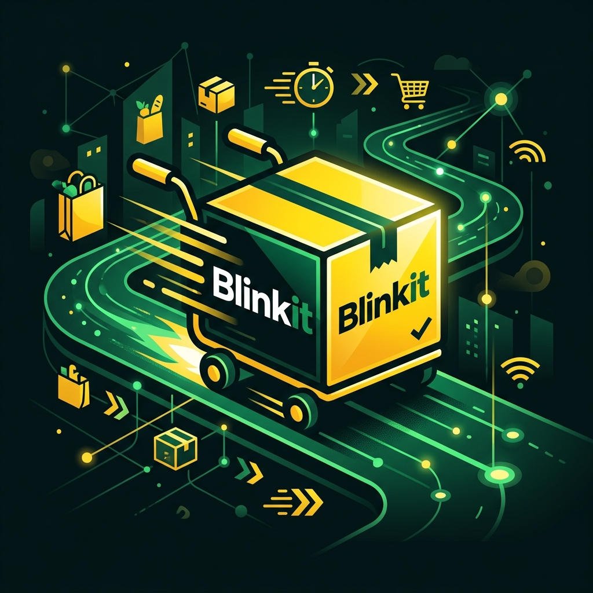
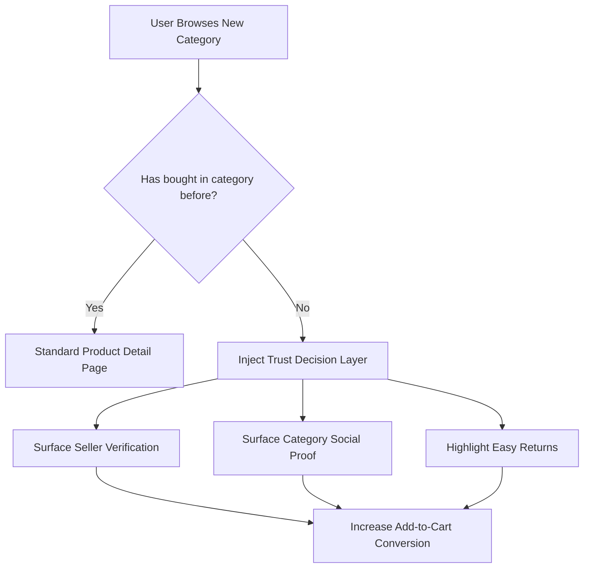

# PRD: Trust Decision Layer — Blinkit Category Expansion

**Author:** Harpreet Kaur
**Program:** NextLeap PM Fellowship — Cohort 48
**Status:** Draft for review
**Doc type:** Product Requirements Document (feature-level, prototype scope)

---

## 1. Background & Problem Statement

Blinkit users reliably return to habitual categories — groceries, staples, daily essentials — but a large share never expand into adjacent categories the app already lists, such as Electronics and Pharmacy. Prior research on this project (secondary review analysis, a 30-respondent survey, and qualitative interviews) was used to test five hypotheses for why this expansion doesn't happen.

A recurring signal across that research is **trust, not intent**: users consider trying a new category, but hesitate at the point of purchase because they lack the confidence signals they'd normally get from habit or brand familiarity (Is this seller legitimate? Do other people actually buy this on Blinkit? Can I return it if it's wrong?). That hesitation shows up specifically on the product detail page, at the moment right before "Add to cart" — not earlier in browsing, and not as a satisfaction problem after purchase.

This PRD scopes a **prototype-level feature**, the "Trust Decision Layer," designed to test whether surfacing the right trust signals at that specific moment measurably reduces first-purchase hesitation in new categories.

## 2. Goal

Give first-time category buyers the minimum trust information they need to convert, exactly at the point of hesitation — without adding friction, without cluttering the experience for users who don't need it, and without fabricating data where none exists yet.

### Non-goals
- This is not a general trust/safety redesign of the product page.
- This is not solving post-purchase experience or re-engagement after a bad experience (see Open Question in §8).
- This is not a backend/data-pipeline spec — the prototype simulates the trigger condition rather than implementing real order-history detection.

### User Flow & Trust Injection

## 3. Target User

**Primary:** An existing, habitual Blinkit user (grocery/staples) who is browsing but has never purchased from a specific new category (e.g., Electronics, Pharmacy) on the platform.

**Explicitly not the target:** New-to-Blinkit users (no habitual trust in the platform at all) and repeat category buyers (already converted, don't need the panel).

## 4. Hypothesis Being Tested

> If we surface targeted, category-specific trust signals (seller verification, social proof, return policy) directly beneath the Add to Cart action on a first-time category product page, first-time conversion intent in that category will increase — because the barrier is confidence at decision point, not product discovery or pricing.

This prototype is built to make that hypothesis demoable and falsifiable in a stakeholder review, not to prove it definitively — actual validation requires usability testing or an A/B test, which is out of scope for this artifact.

## 5. Functional Requirements

### 5.1 Core screens

| Screen | Requirement |
|---|---|
| Home / Browse | Product grid, 2 columns, ≥6 products spanning habitual categories (milk, bread, fruit) and new categories (earbuds, blood pressure monitor). Search bar (non-functional), "Delivery in 10 minutes" messaging near top, green "ADD" button per card. |
| Product Detail | Image, name, price, Add to Cart button. Conditionally renders the Trust Decision Layer panel directly below Add to Cart, per logic in §5.2. |
| Add-to-Cart Confirmation | Non-blocking toast or inline checkmark on tap. No modal, no extra step. |

### 5.2 Trust Decision Layer — panel logic

| Condition | Behavior |
|---|---|
| Product is a **new category** item for the (simulated) user, **with** review history | Show panel: "First time buying this? Here's what to know" — (1) brand/seller verification line, (2) star rating + review count, (3) return policy line. |
| Product is a **new category** item, **without** review history (cold start) | Show reduced panel: brand verification + return policy **only**. No fabricated rating or review count. |
| Product is a **habitual/familiar category** item | No panel. Standard product page only. |

**Hard constraints:**
- Panel is always inline — never a modal or popup.
- Panel never covers or displaces the Add to Cart button.
- Panel must never display a rating or review count for a product that has no real review history (this is the mechanism that proves the feature respects data integrity rather than simulating confidence that doesn't exist).

### 5.3 Demo controls (presentation layer, not part of the simulated app)

Visually separated from the Blinkit UI so it doesn't read as part of the product itself.

1. **Buyer-state toggle:** "Simulate: first-time category buyer" vs. "Simulate: experienced buyer." Switching it re-renders the same product's trust panel state instantly, without navigation — lets a single product be shown both ways live.
2. **Research-notes toggle:** "Show research notes." When on, small annotation bubbles appear next to each trust-panel line, citing the research finding that justified it (e.g., "80–87% of surveyed users cited this as needed before a first purchase" next to the rating line). When off, the UI looks like a normal shipped product with no visible research scaffolding.

### 5.4 Mock data model

Each product record: `name`, `price`, `category`, `image placeholder`, `isFirstTimeCategory` (bool), `hasReviewHistory` (bool), `rating`, `reviewCount`, `brandVerifiedText`, `returnPolicyText`. 6–8 sample products minimum, covering all three panel states (no panel / full panel / cold-start panel).

## 6. Design Requirements

- Primary color: warm, saturated golden-yellow (Blinkit brand approximation); black text/logo mark; white background.
- Bottom tab bar: Home, Categories, Cart, Account.
- Sans-serif typography throughout; minimal, quick-commerce visual language (not marketplace-style).

## 7. Rationale — key product decisions

- **Why simulate the trigger instead of building real order-history detection:** a fabricated "real" backend would be less credible under scrutiny than an explicit, visible simulation. Reviewers trust "flip this switch to see both states" more than a scripted path they can't inspect.
- **Why the research-notes toggle matters most:** it turns the prototype from a UI mockup into a live, inspectable link between each design decision and the evidence that produced it — directly traceable to this project's survey and interview findings.
- **Why the cold-start variant is in scope, not an edge case cut for later:** a panel that always shows confident numbers is indistinguishable from a panel that fabricates them. Explicitly handling the no-data state is what demonstrates the feature won't manufacture false confidence — which matters given this project's broader discipline around not overstating what the data supports.

## 8. Open Question

Should the prototype include the "re-entry after a bad experience" screen from the Figma wireframes (Screen 4)? That copy was previously flagged as untested. Recommend deciding this consciously before scoping it in, rather than letting it in by default — currently **out of scope** for this build.

## 9. Success Criteria (for the prototype, not the shipped feature)

- A reviewer can, in under 60 seconds, see both trust-panel states on the same product via the demo toggle.
- The cold-start product visibly shows a different (reduced, non-fabricated) panel than a product with review history.
- With research notes on, every visible line in the panel can be traced to a specific finding from this project's research.

## 10. Out of Scope for This Prototype

- Real backend/order-history logic
- A/B test instrumentation or measurement
- Post-purchase / return-flow screens
- The Screen 4 re-entry flow (pending decision, §8)
